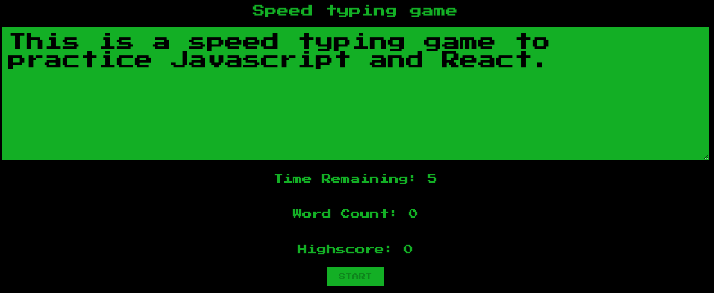

# Speed Typing Game - React


## About The Project
This game was built to practice Javascript and React. 




### Built With:

* [Javascript](https://nodejs.org/en/) - Programming language.
* [ReactJS](https://expressjs.com/pt-br/) - A JavaScript library for building user interfaces.


<!-- GETTING STARTED -->
## Getting Started

### Installation

1. Clone the repo
```sh
git clone https://github.com/pedrovsiqueira/speed-typing-game-react
```
2. Install Yarn packages
```sh
yarn
```
3. Run the app
```sh
yarn start
```

<!-- USAGE EXAMPLES -->
## Usage

The project is deployed and can be accessed at https://speed-typing-game-react.netlify.app/


<!-- CONTRIBUTING -->
## Contributing


1. Fork the Project
2. Create your Feature Branch
```sh
git checkout -b feature/AmazingFeature
```
3. Commit your Changes
```sh
git commit -m 'Add some AmazingFeature'
```
4. Push to the Branch
```sh
git push origin feature/AmazingFeature
```
5. Open a Pull Request


<!-- CONTACT -->
## Contact

Pedro Siqueira - [email](mailto:pedro.v.siqueira@gmail.com) - [linkedin](https://www.linkedin.com/in/pedrovsiqueira/)

Thiago Pizzutti - [email](mailto:tpizzutti@gmail.com) - [linkedin](https://www.linkedin.com/in/pedrovsiqueira/)

Fabrício Polato - [email](mailto:fabriciopolato@gmail.com) - [linkedin](https://www.linkedin.com/in/fabriciopolato/)

